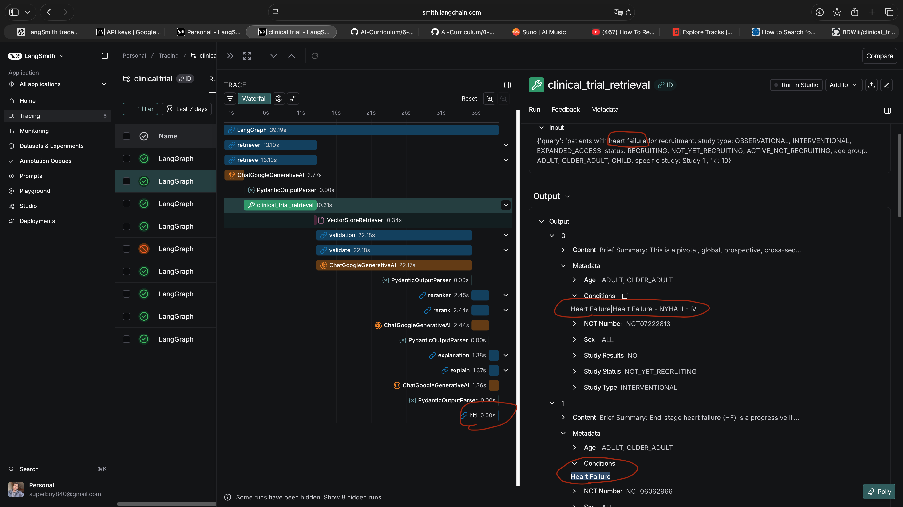

# Clinical Trials Recruitment Agent


## 🏥 Problem Statement
*   **Lack of Awareness (Patients):** 80% of patients don't know clinical trials exist for their conditions.
*   **Complex Eligibility:** Criteria are often hard for patients to understand.
*   **Recruitment Crisis (Trials):** 80% of clinical trials fail to meet enrollment timelines.
*   **Cost & Time:** Patient recruitment is the #1 bottleneck, costing millions and delaying life-saving drugs.
*   **Missed Opportunities:** Patients often arrive after deadlines or don't know where to look.

## 💡 Solution
A **Human-in-the-Loop (HITL) AI Agent SaaS** for healthcare facilities that automates patient recruitment.

*   **Intelligent Filtering:** Scans datasets (e.g., ClinicalTrials.gov) to find eligible candidates.
*   **Multi-Agent Workflow:**
    *   **Retrieval Agent:** Semantic search for relevant trials.
    *   **Reasoning Agent:** Validates eligibility against complex criteria.
    *   **Outreach Agent (Email):** Sends personalized, educational emails to raise awareness.
    *   **Telephony Agent (Voice):** Calls patients to explain the trial, answer questions, and **book appointments**.
*   **Impact:** Speeds up recruitment, reduces costs, and saves customer service overhead.

## 📊 Performance & Overview

### Accurate Retrieval (Qualitative Analysis)
The semantic retrieval engine accurately maps patient queries to relevant trials, even using complex medical terminology.


### User Interface
A clean, doctor-centric dashboard for managing searches and reviewing candidates.


### Data Overview
Structured clinical trial data enabling precise filtering and matching.


## 🚀 Getting Started
```bash
uv run python -m main
```
